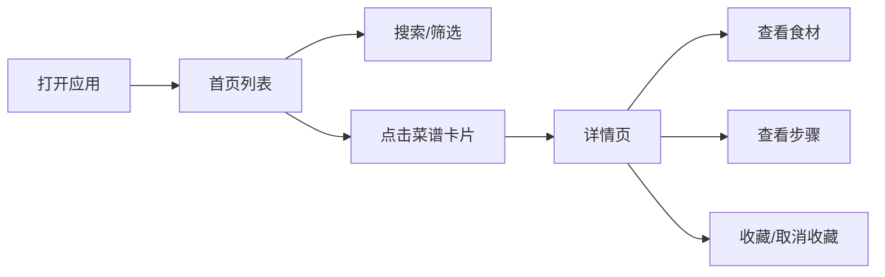

# 家庭菜谱管理应用 — 产品需求文档

## 1. 产品概述

一款面向家庭成员的移动端菜谱管理 Web 应用，用于记录、浏览和共享家庭菜谱。解决家庭菜谱分散、难以传承的问题，让每道菜的做法都能被完整保存和轻松查阅。

- 纯前端实现，数据存储于浏览器本地，支持家庭多用户共享（通过数据导入导出）
- 以杂志编辑风为视觉基调，追求高级感与阅读体验

## 2. 核心功能

### 2.1 用户角色

| 角色 | 说明 | 权限 |
|------|------|------|
| 家庭成员 | 无需注册，直接使用 | 浏览、新增、编辑、删除、收藏菜谱，数据导入导出 |

### 2.2 功能模块

1. **首页**：菜谱列表、分类筛选、搜索、底部导航
2. **菜谱详情页**：封面图、食材清单、制作步骤、烹饪要点、收藏操作
3. **新增/编辑页**：表单录入菜谱信息，支持动态增减食材和步骤
4. **收藏页**：展示收藏的菜谱列表
5. **个人中心页**：数据统计、数据导入导出、关于

### 2.3 页面详情

| 页面名称 | 模块名称 | 功能描述 |
|----------|----------|----------|
| 首页 | 搜索栏 | 顶部固定，支持按菜名、食材搜索 |
| 首页 | 分类标签 | 横向滚动标签：全部/热炒/汤羹/主食/凉菜/甜点/早餐 |
| 首页 | 菜谱卡片列表 | 双列网格布局，展示封面图、菜名、烹饪时间、难度标签 |
| 首页 | 底部导航 | 首页 / 新增 / 收藏 / 我的 |
| 菜谱详情页 | 封面区 | 大图展示，菜名、烹饪时间、难度、收藏按钮 |
| 菜谱详情页 | 食材清单 | 表格形式展示食材、用量、处理方式，支持勾选已备料 |
| 菜谱详情页 | 制作步骤 | 有序列表，每步可展开查看详细描述，支持标记完成 |
| 菜谱详情页 | 关键要点 | 底部展示烹饪关键技巧和注意事项 |
| 新增/编辑页 | 表单区 | 菜名、分类、时间、难度、封面图上传 |
| 新增/编辑页 | 食材录入 | 动态表格，可增删行，输入食材/用量/处理 |
| 新增/编辑页 | 步骤录入 | 可排序列表，每步包含描述文字和可选图片 |
| 新增/编辑页 | 关键要点 | 文本框输入烹饪关键 |
| 收藏页 | 收藏列表 | 与首页类似的卡片布局，仅展示收藏菜谱 |
| 个人中心页 | 数据统计 | 菜谱总数、收藏数、分类分布 |
| 个人中心页 | 数据管理 | 导出JSON备份、导入JSON恢复 |

## 3. 核心流程

### 3.1 浏览菜谱流程

用户打开应用 → 首页展示菜谱列表 → 可搜索或筛选分类 → 点击卡片进入详情页 → 查看食材和步骤 → 可收藏或返回

### 3.2 新增菜谱流程

用户点击底部"新增" → 填写表单 → 添加食材 → 添加步骤 → 保存 → 返回首页

### 3.3 数据导入导出流程

用户进入个人中心 → 点击导出 → 生成JSON文件下载 → 在其他设备点击导入 → 选择JSON文件 → 数据合并/覆盖

## 4. 用户界面设计

### 4.1 设计风格

- **整体风格**：杂志编辑风，大面积留白，精致排版，以内容为核心
- **主色调**：
  - 背景色：`#FAFAF8`（暖白）
  - 主色：`#2C2C2C`（深炭灰，用于标题和重点文字）
  - 辅助色：`#8B8680`（暖灰，用于次要文字）
  - 强调色：`#C75B39`（砖红，用于收藏按钮、标签、交互高亮）
  - 边框/分割线：`#E8E6E3`（浅暖灰）
- **按钮样式**：
  - 主按钮：深炭灰背景 + 白色文字，圆角 8px
  - 次要按钮：白色背景 + 深炭灰边框，圆角 8px
  - 悬浮按钮（新增）：砖红色圆形按钮，带阴影
- **字体**：
  - 标题字体：`"Noto Serif SC", serif`（思源宋体，优雅有杂志感）
  - 正文字体：`"Noto Sans SC", sans-serif`（思源黑体，清晰易读）
  - 菜名标题：20-24px，加粗
  - 正文：14-16px
  - 辅助文字：12-13px
- **布局风格**：
  - 移动端优先，最大宽度 430px 居中
  - 卡片式布局，圆角 12px，轻微阴影
  - 图片占比高，营造美食杂志视觉冲击力
- **图标风格**：线性图标，2px 描边，简洁优雅

### 4.2 页面设计概述

| 页面名称 | 模块名称 | UI 元素 |
|----------|----------|---------|
| 首页 | 搜索栏 | 顶部固定，圆角输入框，灰色背景，搜索图标 |
| 首页 | 分类标签 | 横向滚动，胶囊形状标签，选中状态为深炭灰底白字 |
| 首页 | 菜谱卡片 | 双列网格，图片 4:3 比例，下方文字信息，圆角 12px |
| 首页 | 底部导航 | 底部固定，四个图标+文字，选中为砖红色 |
| 菜谱详情页 | 封面区 | 全宽图片，渐变遮罩，底部菜名和时间信息 |
| 菜谱详情页 | 食材清单 | 卡片容器，表格布局，左侧可勾选圆圈 |
| 菜谱详情页 | 制作步骤 | 编号圆圈 + 标题 + 描述，步骤间有分割线 |
| 菜谱详情页 | 关键要点 | 砖红色左边框强调，列表形式 |
| 新增/编辑页 | 表单区 | 分组卡片，标签在上，输入框在下 |
| 新增/编辑页 | 动态列表 | 食材/步骤可拖拽排序，左滑删除 |
| 收藏页 | 列表区 | 与首页卡片一致，空状态展示插画和提示文字 |
| 个人中心页 | 统计卡片 | 横向排列三个统计数字 |
| 个人中心页 | 功能列表 | 列表形式，右侧箭头，点击触发导入/导出 |

### 4.3 响应式设计

- 移动端优先设计，针对 375px-430px 宽度优化
- 图片懒加载，提升性能
- 触摸区域最小 44x44px
- 底部导航固定，内容区滚动

### 4.4 动画与交互

- 页面切换：淡入淡出，200ms
- 卡片点击：轻微缩放反馈（scale 0.98）
- 收藏按钮：点击时心跳缩放动画
- 步骤勾选：左侧圆圈填充动画，文字划线效果
- 列表加载：骨架屏 → 内容淡入
- 底部导航切换：图标颜色渐变过渡

## 5. 示例数据

应用初始化时预置以下示例菜谱：

### 示例菜谱：辣椒炒肉

- **菜名**：辣椒炒肉
- **分类**：热炒
- **描述**：肉嫩入味、辣椒香、有锅气
- **烹饪时间**：20分钟
- **难度**：中等
- **食材**：
  - 梅花肉 200g 逆纹切2mm片，加盐、1勺生抽、半勺老抽，抓至粘手起胶
  - 五花肉 100g 切2mm片，不腌
  - 薄皮辣椒 300g 去籽，切滚刀块
  - 大蒜 12粒 竖切片
  - 豆豉 半勺 切碎
  - 生抽 2勺 出锅前用
  - 老抽 半勺 上色用
- **步骤**：
  1. 干煸辣椒：空锅不放油，下辣椒边摁边翻，撒1/3茶匙盐，煸至变软出虎皮，盛出备用
  2. 炒五花肉：加油，大火下五花肉煸出油脂，炒至带焦边
  3. 炒香配料：下豆豉碎炒香，再下蒜片炒香
  4. 合炒出锅：倒入辣椒和腌好的梅花肉，大火快速翻炒至肉变色。沿锅边烹入2勺生抽、半勺老抽，喜欢可加味精，炒匀立刻关火出锅
- **关键要点**：
  - 肉嫩：梅花肉逆纹切 + 抓至粘手起胶
  - 干香：五花肉不腌，直接煸出焦边
  - 辣椒香：空锅干煸出虎皮，别跳过
  - 有锅气：全程大火，快炒快出
