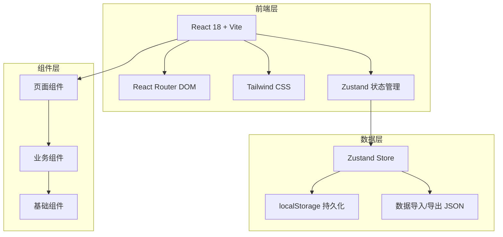

# 家庭菜谱管理应用 — 技术架构文档

## 1. 架构设计



## 2. 技术选型

| 技术 | 版本 | 用途 |
|------|------|------|
| React | 18.x | UI 框架 |
| Vite | 5.x | 构建工具 |
| Tailwind CSS | 3.x | 原子化 CSS |
| React Router DOM | 6.x | 路由管理 |
| Zustand | 4.x | 状态管理 |
| Lucide React | latest | 图标库 |
| date-fns | latest | 日期处理 |

## 3. 路由定义

| 路由 | 页面 | 说明 |
|------|------|------|
| `/` | 首页 | 菜谱列表，默认页面 |
| `/recipe/:id` | 菜谱详情页 | 查看菜谱完整信息 |
| `/add` | 新增菜谱页 | 创建新菜谱 |
| `/edit/:id` | 编辑菜谱页 | 修改已有菜谱 |
| `/favorites` | 收藏页 | 收藏的菜谱列表 |
| `/profile` | 个人中心页 | 统计、导入导出 |

## 4. 数据模型

### 4.1 TypeScript 类型定义

```typescript
// 食材项
interface Ingredient {
  id: string;
  name: string;        // 食材名称
  amount: string;      // 用量
  preparation: string; // 处理方式
  checked?: boolean;   // 备料勾选状态（仅运行时）
}

// 制作步骤
interface Step {
  id: string;
  order: number;       // 步骤序号
  title: string;       // 步骤标题（如"干煸辣椒"）
  description: string; // 步骤详细描述
  image?: string;      // 步骤配图（可选）
  completed?: boolean; // 完成状态（仅运行时）
}

// 菜谱
interface Recipe {
  id: string;
  name: string;              // 菜名
  category: Category;        // 分类
  description: string;       // 简介描述
  coverImage: string;        // 封面图（URL 或 base64）
  prepTime: number;          // 备料时间（分钟）
  cookTime: number;          // 烹饪时间（分钟）
  difficulty: Difficulty;    // 难度
  ingredients: Ingredient[]; // 食材清单
  steps: Step[];             // 制作步骤
  tips: string[];            // 关键要点
  isFavorite: boolean;       // 是否收藏
  tags: string[];            // 标签
  createdAt: string;         // 创建时间 ISO 字符串
  updatedAt: string;         // 更新时间 ISO 字符串
}

// 分类枚举
type Category = 'all' | 'stir-fry' | 'soup' | 'staple' | 'cold-dish' | 'dessert' | 'breakfast';

// 难度枚举
type Difficulty = 'easy' | 'medium' | 'hard';

// 应用状态
type AppState = {
  recipes: Recipe[];
  searchQuery: string;
  activeCategory: Category;
  addRecipe: (recipe: Omit<Recipe, 'id' | 'createdAt' | 'updatedAt'>) => void;
  updateRecipe: (id: string, recipe: Partial<Recipe>) => void;
  deleteRecipe: (id: string) => void;
  toggleFavorite: (id: string) => void;
  setSearchQuery: (query: string) => void;
  setActiveCategory: (category: Category) => void;
  exportData: () => string;
  importData: (json: string) => void;
};
```

### 4.2 localStorage 数据结构

```typescript
// Storage Key: family-recipes-data
interface StorageData {
  version: number;      // 数据版本，用于迁移
  recipes: Recipe[];
  exportAt?: string;    // 导出时间
}
```

## 5. 组件架构

### 5.1 页面组件（Pages）

| 组件 | 路径 | 职责 |
|------|------|------|
| HomePage | `src/pages/HomePage.tsx` | 首页，列表+搜索+筛选 |
| RecipeDetailPage | `src/pages/RecipeDetailPage.tsx` | 菜谱详情 |
| AddRecipePage | `src/pages/AddRecipePage.tsx` | 新增菜谱 |
| EditRecipePage | `src/pages/EditRecipePage.tsx` | 编辑菜谱 |
| FavoritesPage | `src/pages/FavoritesPage.tsx` | 收藏列表 |
| ProfilePage | `src/pages/ProfilePage.tsx` | 个人中心 |

### 5.2 业务组件（Components）

| 组件 | 路径 | 职责 |
|------|------|------|
| BottomNav | `src/components/BottomNav.tsx` | 底部导航栏 |
| RecipeCard | `src/components/RecipeCard.tsx` | 菜谱卡片 |
| CategoryTabs | `src/components/CategoryTabs.tsx` | 分类标签栏 |
| SearchBar | `src/components/SearchBar.tsx` | 搜索栏 |
| IngredientList | `src/components/IngredientList.tsx` | 食材清单（可勾选） |
| StepList | `src/components/StepList.tsx` | 步骤列表（可标记完成） |
| RecipeForm | `src/components/RecipeForm.tsx` | 菜谱表单 |
| ImageUploader | `src/components/ImageUploader.tsx` | 图片上传组件 |
| EmptyState | `src/components/EmptyState.tsx` | 空状态展示 |
| StatsCard | `src/components/StatsCard.tsx` | 统计卡片 |

### 5.3 自定义 Hooks

| Hook | 路径 | 职责 |
|------|------|------|
| useRecipes | `src/hooks/useRecipes.ts` | 菜谱数据操作 |
| useLocalStorage | `src/hooks/useLocalStorage.ts` | localStorage 同步 |

## 6. 状态管理（Zustand Store）

```typescript
// src/store/recipeStore.ts
import { create } from 'zustand';
import { persist } from 'zustand/middleware';

interface RecipeStore {
  recipes: Recipe[];
  searchQuery: string;
  activeCategory: Category;
  
  // Actions
  addRecipe: (recipe: RecipeInput) => void;
  updateRecipe: (id: string, updates: Partial<Recipe>) => void;
  deleteRecipe: (id: string) => void;
  toggleFavorite: (id: string) => void;
  setSearchQuery: (query: string) => void;
  setActiveCategory: (category: Category) => void;
  
  // Data transfer
  exportToJSON: () => string;
  importFromJSON: (json: string) => void;
}

export const useRecipeStore = create<RecipeStore>()(
  persist(
    (set, get) => ({
      // ... implementation
    }),
    {
      name: 'family-recipes-data',
      version: 1,
    }
  )
);
```

## 7. 项目目录结构

```
family-recipe/
├── public/
│   └── mock-images/          # 示例图片
├── src/
│   ├── pages/                # 页面组件
│   │   ├── HomePage.tsx
│   │   ├── RecipeDetailPage.tsx
│   │   ├── AddRecipePage.tsx
│   │   ├── EditRecipePage.tsx
│   │   ├── FavoritesPage.tsx
│   │   └── ProfilePage.tsx
│   ├── components/           # 可复用组件
│   │   ├── BottomNav.tsx
│   │   ├── RecipeCard.tsx
│   │   ├── CategoryTabs.tsx
│   │   ├── SearchBar.tsx
│   │   ├── IngredientList.tsx
│   │   ├── StepList.tsx
│   │   ├── RecipeForm.tsx
│   │   ├── ImageUploader.tsx
│   │   ├── EmptyState.tsx
│   │   └── StatsCard.tsx
│   ├── hooks/                # 自定义 Hooks
│   │   ├── useRecipes.ts
│   │   └── useLocalStorage.ts
│   ├── store/                # 状态管理
│   │   └── recipeStore.ts
│   ├── types/                # TypeScript 类型
│   │   └── index.ts
│   ├── data/                 # 初始数据
│   │   └── mockRecipes.ts
│   ├── utils/                # 工具函数
│   │   └── helpers.ts
│   ├── App.tsx
│   ├── main.tsx
│   └── index.css
├── index.html
├── package.json
├── tailwind.config.js
├── tsconfig.json
└── vite.config.ts
```

## 8. 构建与部署

- **开发**：`npm run dev`
- **构建**：`npm run build`
- **预览**：`npm run preview`
- **部署**：静态文件可部署至任意静态托管服务（Vercel、Netlify、GitHub Pages 等）

## 9. 性能优化

- 图片懒加载（`loading="lazy"`）
- 组件懒加载（React.lazy + Suspense）
- localStorage 数据压缩（如数据量大时）
- 虚拟列表（如菜谱数量超过 100 条）
